# BOOKSHELF

✨ Para acessar a aplicação [Clique aqui!](https://social-network-trio.web.app/) ✨

## Índice

- [1. Introdução](#1-introdução)
- [2. Sobre a aplicação](#2-sobre-a-aplicação)
- [3. Processo de criação](#3-processo-de-criação)
- [4. Testes](#4-testes)
- [5. Tecnologias utilizadas](#5-tecnologias-utilizadas)
- [6. Desenvolvedoras](#6-desenvolvedoras)

---

## 1. Introdução

Neste projeto realizamos a construção de uma rede social através da manipulação e persistência de dados através de um banco de dados não relacional e em tempo real.
O projeto proposto pela Laboratória foi realizado em trio. A estratégia de desenvolvimento usada foi pair programming, code review e sub-divisão das histórias de usuário.

## 2. Sobre aplicação

A rede social desenvolvida tem como objetivo permitir que os usuários compartilhem suas experiências literárias criando resenhas, visualizar e curtir publicações de outros leitores.

## 3. Processo de criação

💡 Organização

Ao receber o projeto toda a organização das tarefas e processos foram realizadas utilizando o modelo de Kanban. Depois de toda a organização feita, definimos o tempo de cada tarefa e o que seria entregue em cada sprint, critérios de aceitação e definição de pronto. A estratégia de desenvolvimento usada foi pair programming, code review e sub-divisão das histórias de usuário. A aplicação foi desenvolvida seguindo a técnica mobile first.

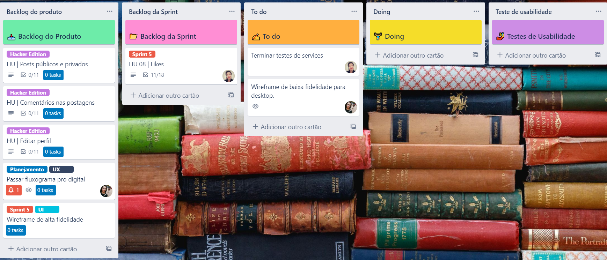

💡 Interface

O principal objetivo foi desenvolver uma interface em que fossem exibidas apenas as funcionalidades necessárias de forma simples e amigável ao usuário. Queríamos que interface da aplicação fosse semelhante a uma página de livro.

💻 Wireframe inicial desktop

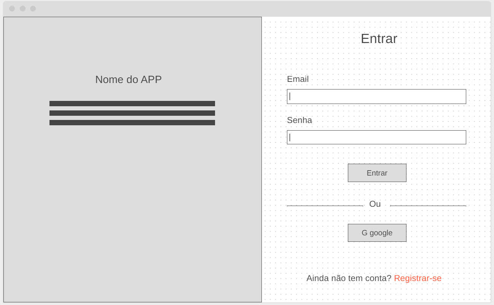
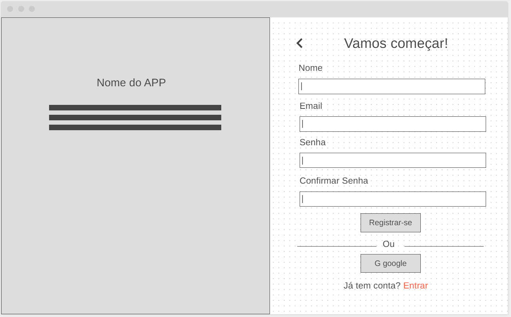
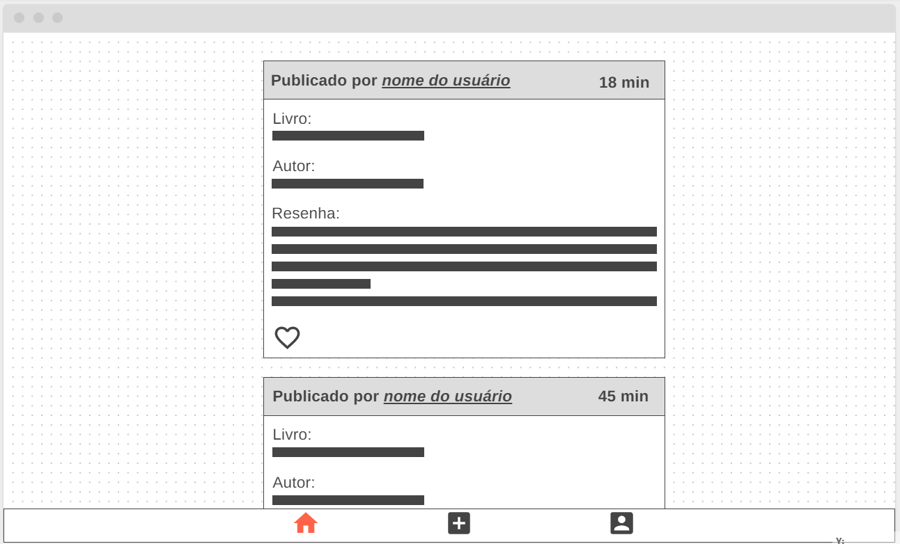
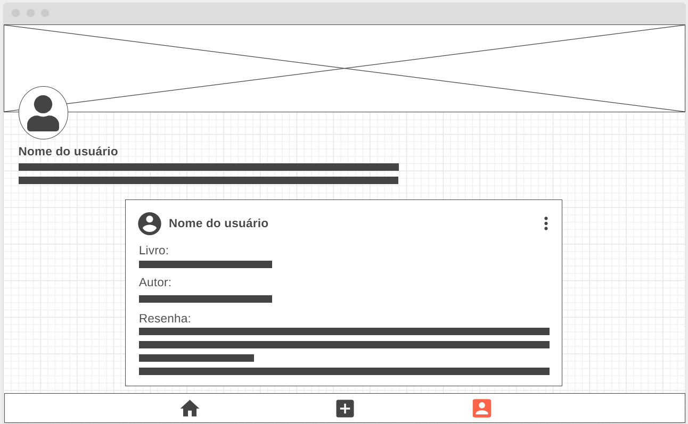

📱 Wireframe inicial mobile

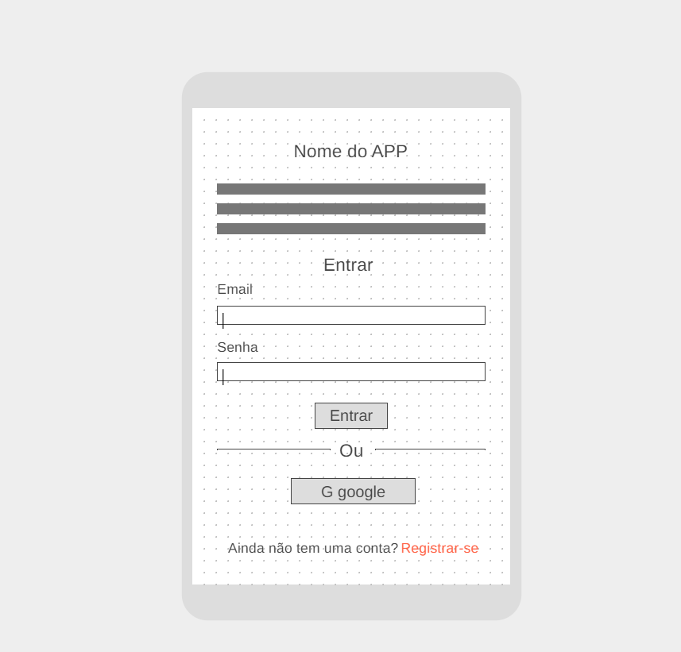
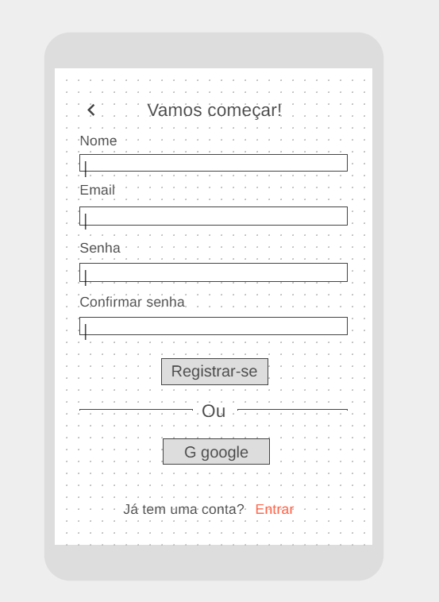
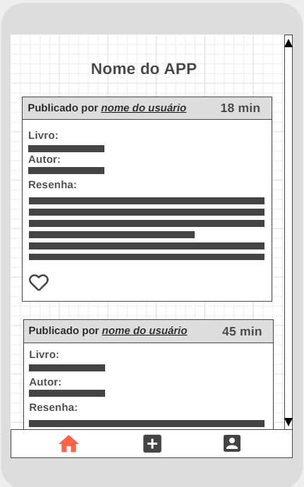
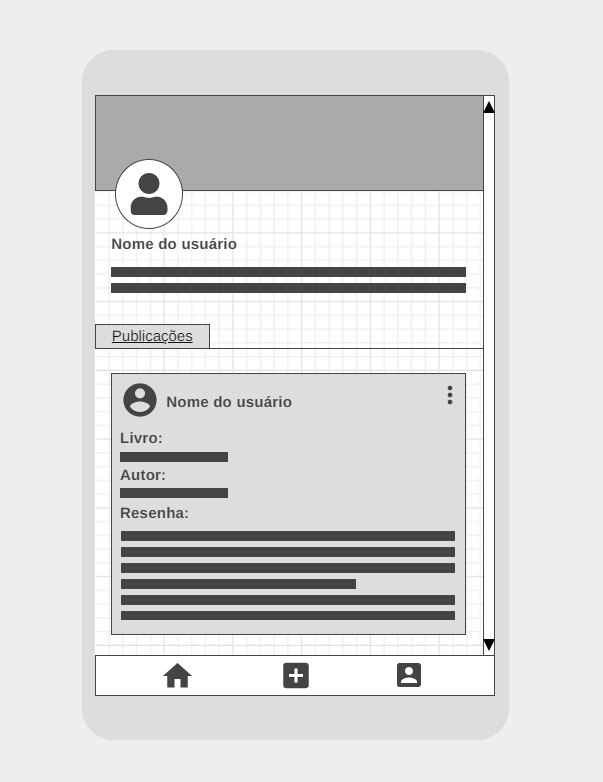

💻 Interface final desktop

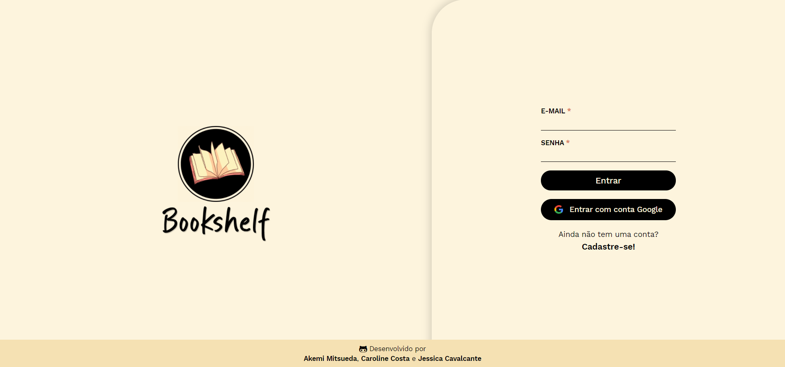
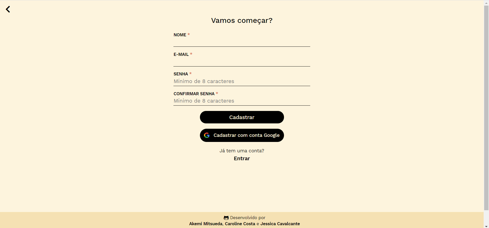
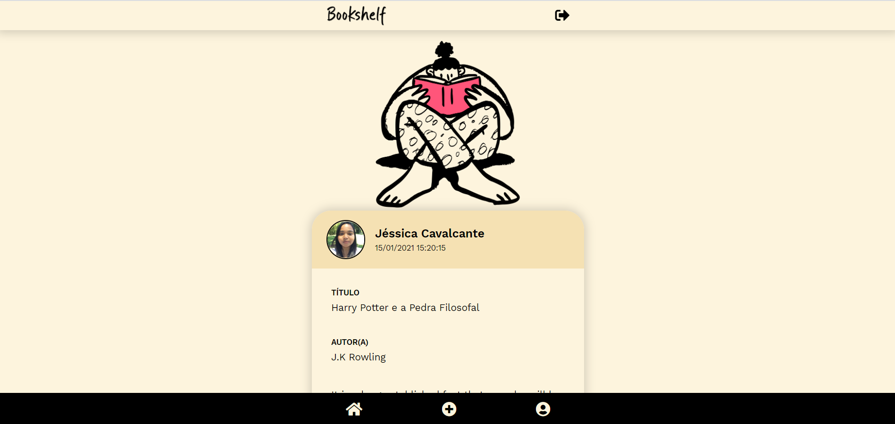
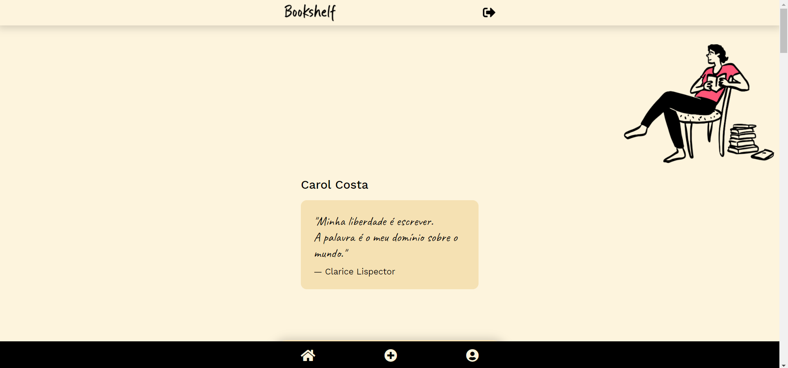

📱 Interface final mobile

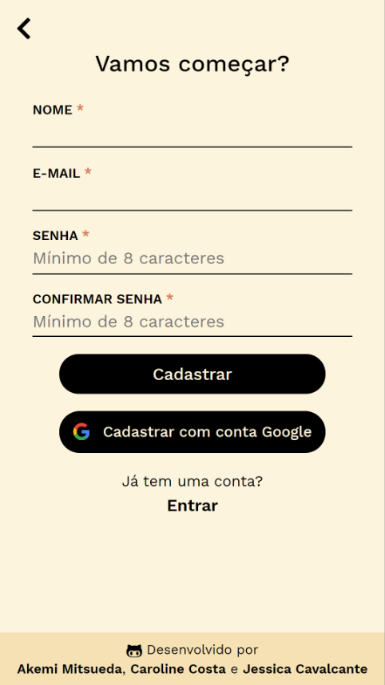

💡 Logo

Criamos uma logo que estivesse de acordo com o tema e que tivesse personalidade.

💡 Ilustrações

Escolhemos ilustrações modernas que proporcionam páginas mais divertidas e inspiradoras, sem perder a identidade e tornar-se algo infantil.

💡 Paleta de cores

Com base no tom de amarelo utilizado nas páginas (papel pólen) e o preto que remete a cor da tinta impressa nos livros desenvolvemos a paleta de cores.

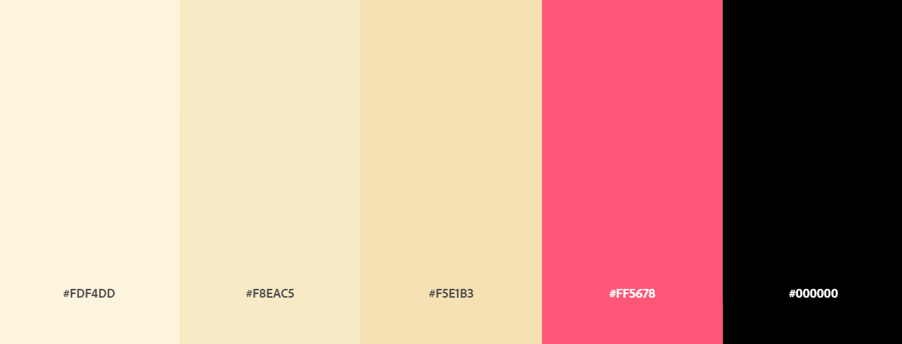

## 4. Testes

🔎 Usabilidade

Realizamos testes com algumas das pessoas que se dispuseram testar a usabilidade durante o processo de desenvolvimento. Com isso, identificamos que:

⚠️ Os usuários apontaram que gostariam que além dos alertas avisando que todos os campos da resenha tinham que ser preenchidos, gostariam que tivesse algo visível antes do erro ocorrer.

✔️ Como solução deixamos asterisco ao lado da descrição de cada campo para indicar que o campo era obrigatório.

⚠️ Os usuários acharam era necessário ter uma mensagem explicando no realizar publicações.

✔️ Como solução no perfil do usuário acrescentamos uma mensagem com as instruções.

🔎 Técnico

Foram desenvolvidos testes unitários com jest para identificar possíveis falhas nas funções utilizadas, possibilitando a correção caso necessário antes de definir o produto como pronto.

## 5. Tecnologias utilizadas

🔧 Para esse projeto foram usados:

- JavaScript(ES6+)
- HTML5
- CSS3
- Firebase Hosting
- Firebase Firestore
- Firebase Auth
- EsLint

## 6. Como rodar localmente

1. Antes de mais nada, se assegure de ter um bom 📝 editor de texto, algo como o Visual Studio Code ou Atom.
2. Para executar os comandos você precisará de um 🐚 UNIX Shell, que é um programa que interpreta linhas de comando (command-line interpreter) e também deve ter o git instalado. Se você usa um sistema operacional "UNIX-like", como GNU/Linux ou MacOS, você já tem um shell (terminal) instalado (e provavelmente o git também). Se você usa Windows pode baixar a versão completa do Cmder que inclue o Git bash, embora seja recomendado que você teste 🐧 GNU/Linux. Se tem Windows 10 ou superior pode usar o Windows Subsystem for Linux.
3. Faça o 🍴 fork desse repositório.
4. ⬇️ Clone o fork para seu computador (cópia local).
5. 📦 Instale as dependências do projeto rodando o comando npm install. Mas antes disso tenha certeza de ter instalado o Node.js (que inclui o npm).

### Instalação do Firebase

Este projeto está configurado para rodar por meio do servidor do Firebase. Para isso, será necessário possuir o Firebase CLI instalado globalmente em sua máquina. Utilize o comando npm install -g firebase-tools

Inicie um novo projeto web no console do Firebase (pode desabilitar o analytics).

Caso apareça a opção de habilitar o Hosting na tela seguinte, selecionar.

Clique no menu lateral Cloud Firestore para criar uma nova database como production mode e escolher a região us-east1.

##### IMPORTANTE rodar todos os comandos do Firebase no terminal a partir da pasta raiz do projeto.

Executar o comando firebase login e realizar o login por meio de uma conta Google - deve abrir uma janela automaticamente, se não abrir pode clicar no link que vai aparecer no console.

Executar o comando firebase init para iniciar o setup do projeto.

Selecionar Hosting (aperte espaço para selecionar essa opção e depois enter).

Selecionar Use an existing project (o terminal vai mostrar o nome do projeto que você acabou de criar no site do Firebase).

Escrever src para definir como public directory (o padrão vai estar como public).

Escrever y para selecionar como SPA.

Escrever N para não fazer builds e deploys automáticos com GitHub.

O Firebase vai dizer que src/index.html já existe e pergunta se quer sobrescrever. Sugiro dar N, para não sobrescrever o index.html.

Se der tudo certo, o Firebase vai criar o arquivo .firebaserc de configuração na pasta do projeto.

Instale as dependências do projeto rodando o comando npm install.

Para iniciar sua aplicação web, use o comando npm start. Com esse comando, você deve ver em http://localhost:5000 uma página padrão do Firebase, que está sendo renderizada de src/index.html.

## 7. Desenvolvedoras

👩 [Akemi Mitsueda](https://github.com/akemimeka)

👩 [Caroline Costa](https://github.com/CarolineSCosta)

👩 [Jessica Cavalcante](https://github.com/JessicaCavalcante)
